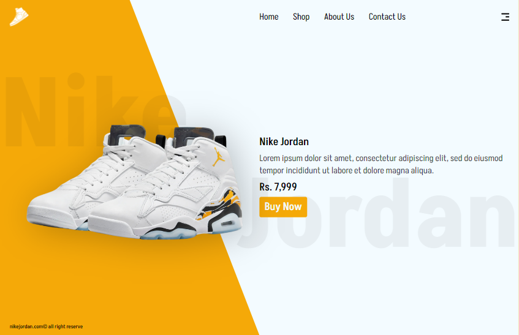

# Réplica de Diseño Web de Figma

**Réplica de un diseño web basado en un archivo de Figma de la comunidad.**

Este proyecto consiste en la implementación del diseño "How to Choose Backgrounds in Web Design: UI/UX Design Tutorial for Beginners [2024]" proveniente de Figma Community. La réplica fue realizada utilizando HTML y CSS, optimizada específicamente para MacBook Pro 16". El diseño original es moderno y está centrado en la presentación de un producto en venta (zapatilla).

## Capturas de pantalla

### Diseño original en Figma:

### Resultado de mi réplica:

Link del diseño original: [Figma Design](https://www.figma.com/design/lch2wOEHBzQ95sqgJorezK/How-to-Choose-Backgrounds-in-Web-Design%3A-UI%2FUX-Design-Tutorial-for-Beginners-%5B2024%5D-(Community)?node-id=0-1&node-type=CANVAS&t=SJMLgzQewBedke4j-0)
